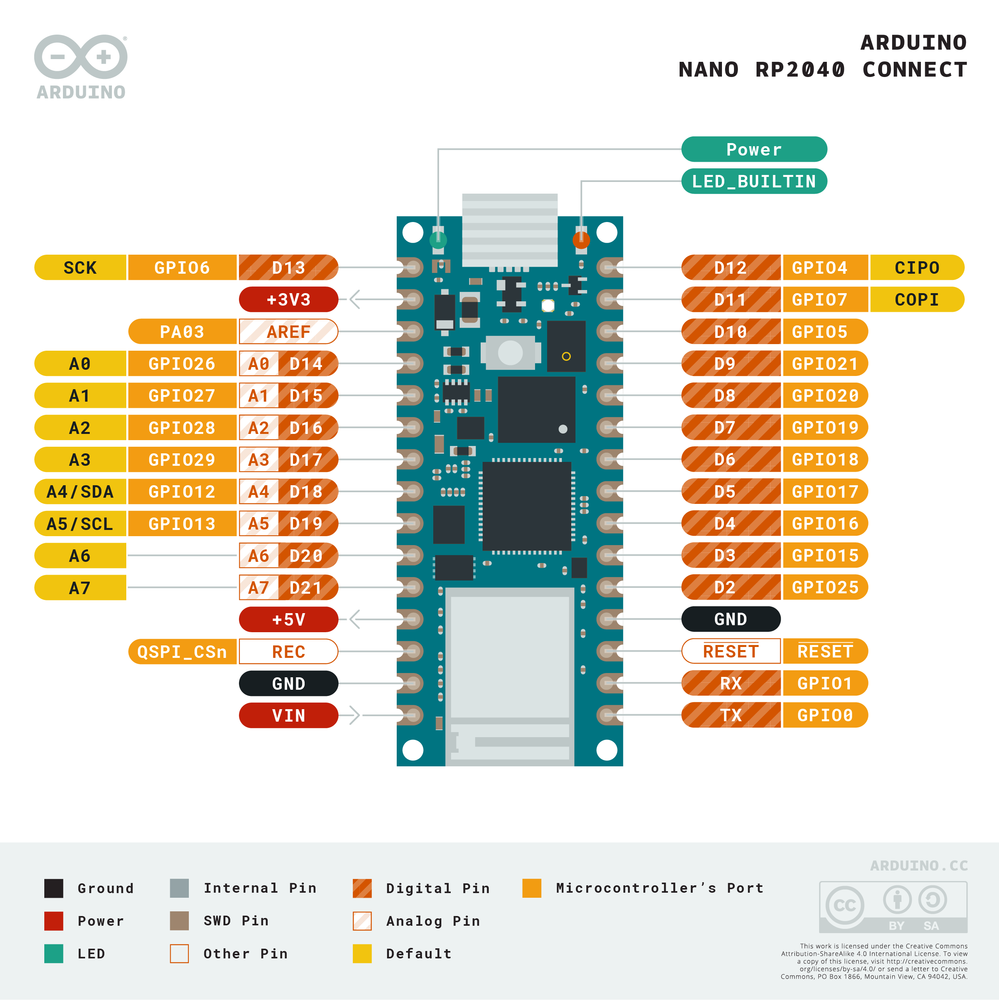
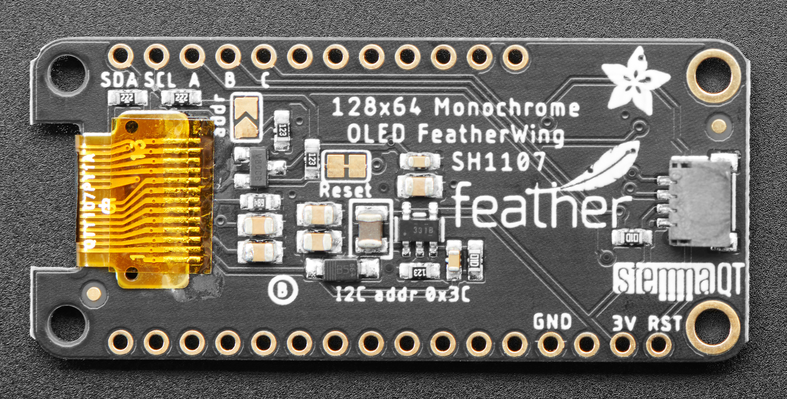

# Bluetooth Specialized Display Circuit Diagram (https://github.com/carterd/BTSpecializedDisplay)

This Readme descibes the components and circuit connections for the external Ebike display for Specialized Turbo bikes, 
these include Kenevo/Levo/Creo.

# Components

The circuit for the software is based on two components these are as follows:

 * Arduino Nano RP2040 Connect, https://docs.arduino.cc/hardware/nano-rp2040-connect

 * Adafruit 128x64 OLED Featherwing, https://learn.adafruit.com/adafruit-128x64-oled-featherwing

# Wiring Diagram

The wiring diagram is as follows:
```
      ┌──────────────────────────────────────────────────────────────┐
      │                                                              │
   ┌──┼────────────────────────────────────────────────────────────┐ │
   │  │                                                            │ │
┌──┼──┼──────────────────────────────────────────────────────────┐ │ │
│  │  │                                                          │ │ │
│  │  │  ┌───────────────────────────────────────────────────┐   │ │ │
│  │  │  │                                                   │   │ │ │
│  │  │  │  ┌────────────────────────────────────────────────┼─┐ │ │ │
│  │  │  │  │                                                │ │ │ │ │           ┌───────────┐
│  │  │  │  │    ┌───────┐                  ┌───────┐        │ │ │ │ │   ┌───────┤           ├───────┐
│  │  │  │  │    │       │                  │       │        │ │ │ │ │   │    GRN│           │ORG    │
│  │  │  │  │    │       └──────────────────┘       │        │ │ │ │ │   │    LED│   Micro   │LED    │
│  │  │  │  │    │                                  │        │ │ │ │ │   │       │    USB    │       │
│  │  │  │  └────┤SDA ┌────────────────────────┐    ├──      │ │ │ │ │ ──┤D13    │           │    D12├──
│  │  │  │       │    │                        │    │        │ │ │ │ │   │       │           │       │
│  │  │  └───────┤SCL │                        │    ├── ┌────┼─┼─┼─┼─┼───┤+3V3   └───────────┘    D11├──
│  │  │          │    │                        │    │   │    │ │ │ │ │   │                           │
│  │  └──────────┤ A  │                        │    ├── │    │ │ │ │ │ ──┤AREF                    D10├──
│  │             │    │                        │    │   │    │ │ │ │ │   │                           │
│  └─────────────┤ B  │                        │    ├── │    │ │ │ │ └───┤D14                      D9├──
│                │    │                        │    │   │    │ │ │ │     │                           │
└────────────────┤ C  │         128x64         │    ├── │    │ │ │ └─────┤D15                      D8├──
                 │    │       Monochrome       │    │   │    │ │ │       │                           │
               ──┤    │    OLED FeatherWing    │    ├── │    │ │ └───────┤D16                      D7├──
                 │    │         SH1107         │    │   │    │ │         │         ARDUINO           │
               ──┤    │                        │    ├── │  ┌─┼─┼─────────┤D17        NANO          D6├──
                 │    │                        │    │   │  │ │ │         │          RP2040           │
               ──┤    │                        │    ├── │  │ │ └─────────┤SDA      CONNECT         D5├──
                 │    │                        │    │   │  │ │           │                           │
               ──┤    │                        │    ├── │  │ └───────────┤SCL                      D4├──
                 │    │                        │    │   │  │             │                           │
               ──┤    │                        │    ├── │  │           ──┤D20                      D3├──
                 │    │                        │    │   │  │             │                           │
               ──┤    │                        │    ├── │  │           ──┤D21                      D2├──
                 │    │                        │    │   │  │             │                           │
               ──┤    │                        │    ├── │  │           ──┤+5V                     GND├──
                 │    │                        │    │   │  │             │                      _____│
                 │    │                        │    ├── │  │           ──┤REC  ┌───────────────┐RESET├──
                 │    └────────────────────────┘    │   │  │             │     │               │     │
                 │                               GND├───┼──┼──────█──────┤GND  │               │   RX├──
                 │ ┌───┐                            │   │  │      │      │     │               │     │
                 │ │   │  ┌───┐  ┌───┐  ┌───┐     3V├───┘  │      │  ┌───┤VIN  │               │   TX├──
                 │ │ O │  │   │  │   │  │   │       │      │      │  │   │     │               │     │
                 │ │   │  │ O │  │ O │  │ O │    RST├──────┘      │  │   │     ├─┬─────────────┤     │
                 │ └───┘  │   │  │   │  │   │       │             │  │   │     │ │┼┼┼┼┼┼┼┼┼┼┼┼┼│     │
                 │        └───┘  └───┘  └───┘       │             │  │   └─────┴─┴─────────────┴─────┘
                 │                                  │             │  │
                 └──────────────────────────────────┘             │  │
                                                                  │  │
                                                                  │  │
                   POWER LEAD GND         ────────────────────────┘  │
                                                                     │
                   POWER LEAD 4-20V       ───────────────────────────┘
```
The pinouts of the two components are as follows, for the Arduino Nano RP2040 Connect as follows:



Note that for the pinouts for the Adafruit OLED 128x64 the image below is showing the view from the bottom of device, whereas in the circuit diagram above the 128x64 is shown from above.



